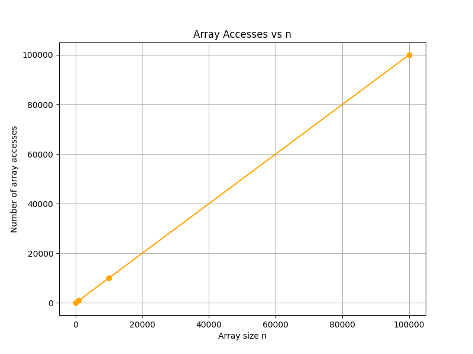
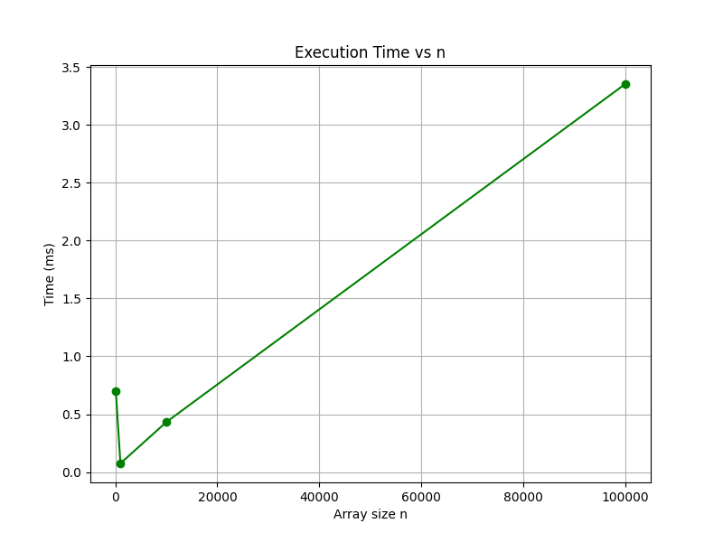

# Assignment 2 — Kadane’s Algorithm (Maximum Subarray Sum)

## Overview

This project implements Kadane’s Algorithm for finding the maximum subarray sum and analyzes its performance both theoretically and empirically.
It is part of Assignment 2: Algorithmic Analysis and Peer Code Review.
The project follows a clean architecture with modular structure, code quality standards, benchmarking tools, and performance visualization.
---

## Project Structure

* assignment2-kadanes-algorithm
* ├── src/
* │ ├── main/java/
* │ │ ├── algorithms/KadanesAlgorithm.java
* │ │ ├── metrics/PerformanceTracker.java
* │ │ └── cli/BenchmarkRunner.java
* │ └── test/java/
* │ └── algorithms/KadanesAlgorithmTest.java
* │
* ├── docs/
* │ ├── analysis-report.pdf
* │ └── performance-plots/
* │ ├── data.csv
* │ ├── time_vs_n.png
* │ ├── comparisons_vs_n.png
* │ ├── array_accesses_vs_n.png
* │ └── plot_benchmarks.py
* │
* ├── README.md
* └── pom.xml


---

## How to Build and Run

### 1. Compile
```bash
mvn clean compile 
```
2. Run Tests

```bash
mvn test
```


3. Run Benchmark

```bash
mvn exec:java -Dexec.mainClass="cli.BenchmarkRunner"
```


Results are saved to:

docs/performance-plots/data.csv

### Example Output (data.csv)
| n    | time_ms | comparisons| array_accesses |
|------|--------|---|---|
| 100, | 0.76340 |198 | 99 |
| 1000 | 0.07470 | 1998|999 |
| 10000 | 0.43530 |19998|9999 |
| 100000| 3.66530 | 199998|99999 |


```bash
pip install pandas matplotlib

```

Run script

```bash
python3 docs/performance-plots/plot_benchmarks.py

```

Output files

    time_vs_n.png

    comparisons_vs_n.png

    array_accesses_vs_n.png

All plots are saved in docs/performance-plots/.

## array_accesses_vs_n


## comparisons_vs_n.png


## time_vs_n.png


### Complexity
|Case  |	Time|	Space|
|------|---|---|
|Best|	Ω(n)|	O(1)|
|Average|	Θ(n)|	O(1)|
|Worst|	O(n)|	O(1)|

Kadane’s Algorithm runs in linear time with constant space.
Branches

